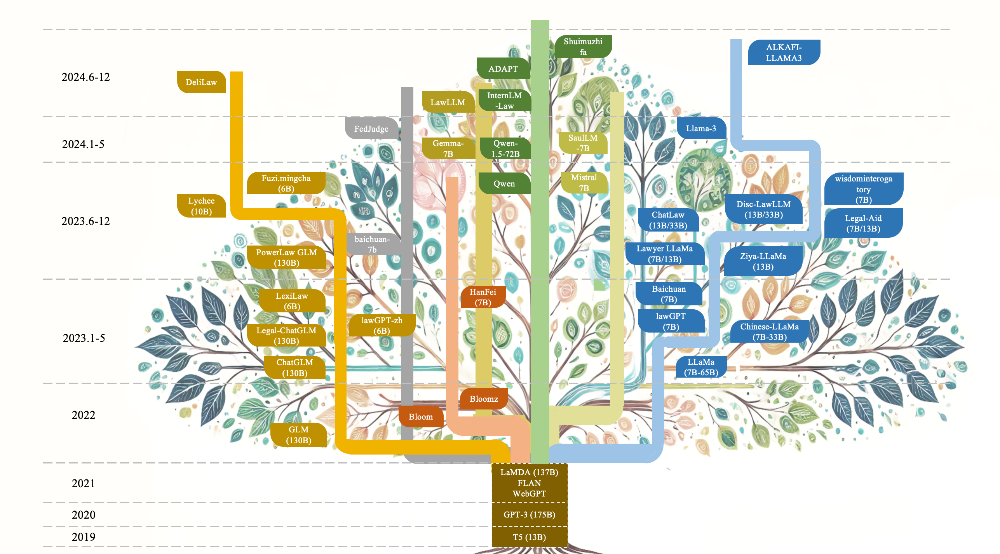
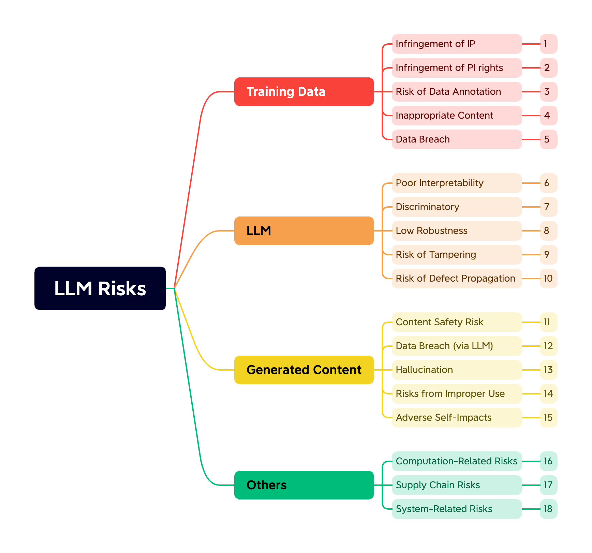

# LLM Regulation

## Content

- [LLM Regulation](#llm-regulation)
  - [Content](#content)
  - [AI for Law](#ai-for-law)
    - [Legal LLM History](#legal-llm-history)
  - [Law for AI](#law-for-ai)
    - [AI Risk Overview](#ai-risk-overview)
      - [A. Training Data](#a-training-data)
      - [B. The LLM Itself](#b-the-llm-itself)
      - [C. Generated Content](#c-generated-content)
      - [D. Others](#d-others)
      - [**Summary**](#summary)
    - [AI Governance related Documents](#ai-governance-related-documents)
    - [AI Related Lawsuits](#ai-related-lawsuits)
      - [Copyright Infringement of Training Data](#copyright-infringement-of-training-data)
      - [Copyrightability of Generated Content](#copyrightability-of-generated-content)
      - [Personal Data Infringement of Training Data](#personal-data-infringement-of-training-data)

## AI for Law

### Legal LLM History

## Law for AI
This part include: AI Risk Overview, AI Government related Documents and AI Related Lawsuits.

### AI Risk Overview
Below is a brief overview of 18 identified risks of LLMs, grouped by four main categories: **Training Data**, **The LLM Itself**, **Generated Content**, and **Others**. 

---

#### A. Training Data

1. **Infringement of IP**  
   - **What It Is**: When copyrighted text, images, or other media are used in the training dataset without permission, models risk infringing on intellectual property rights.  
   - **Example**: GitHub Copilot was criticized for occasionally generating code that was identical or extremely similar to existing copyrighted code, sparking debates on fair use.  
   - **Source**:  
     - [Developers warned: GitHub Copilot code may be licensed (TechTarget, 2022)](https://www.techtarget.com/searchsoftwarequality/news/252526359/Developers-warned-GitHub-Copilot-code-may-be-licensed)

2. **Infringement of PI (Personal Information) Rights**  
   - **What It Is**: Training data might contain personal data (e.g., names, addresses, sexual orientation), breaching privacy regulations like GDPR.  
   - **Example**: Italy’s data protection authority briefly banned ChatGPT in 2023 over concerns that personal information was being collected without adequate legal basis.  
   - **Source**:  
     - [Report of the work undertaken by the ChatGPT Taskforce (EDPB, 2023)](https://www.edpb.europa.eu/our-work-tools/our-documents/other/report-work-undertaken-chatgpt-taskforce_en)

3. **Risk of Data Annotation**  
   - **What It Is**: The annotation process can expose human annotators to confidential or sensitive content (e.g., trade secrets, personal data). Annotators might also introduce bias or errors.  
   - **Example**: Annotation practices have been found to encode gender biases into AI systems. For instance, sentiment analysis models have been highlighted for biased results, where sentiments expressed by marginalized groups are labeled more negatively.  
   - **Source**:  
     - [The Forgotten Layers: How Hidden AI Biases Are Lurking in Dataset Annotation Practices (UNITE, 2024)](https://www.unite.ai/the-forgotten-layers-how-hidden-ai-biases-are-lurking-in-dataset-annotation-practices/?utm_source=chatgpt.com)

4. **Inappropriate Content**  
   - **What It Is**: Inappropriate content refers to content in the training data that may be controversial, illegal, or harmful. The risks of inappropriate content stem from various sources, including but not limited to the issues outlined in Risks 1–3, as well as potential causes such as data poisoning or unreasonable data scraping practices.  
   - **Example**:   
   - **Source**:  
     - 

5. **Data Breach**  
   - **What It Is**: Large training sets and their accompanying metadata can be stolen or leaked—especially if cloud storage or annotation platforms are compromised. Please note that the risk mentioned here is different from the data breach in Risk 13. The latter primarily refers to the model's output containing leaked personal information, protected works of others, trade secrets, and similar content.
   - **Example**:   
   - **Source**:  
     - 

#### B. The LLM Itself

6. **Poor Interpretability**  
   - **What It Is**: Neural networks—especially large ones—are often “black boxes,” making it difficult to explain how they arrive at specific outputs.  
   - **Example**:   
   - **Source**:  
     - 

7. **Discriminatory (Bias)**  
   - **What It Is**: Discriminatory of LLMs mainly stems from risks at the training data level. In addition, factors such as model design and the training process may also lead to the discriminatory.  
   - **Example**: Microsoft’s Tay chatbot quickly started to generate racist content on Twitter after interacting with trolls, demonstrating how biases can be learned and repeated.  
   - **Source**:  
     - 

8. **Low Robustness**  
   - **What It Is**: Small changes or “adversarial” prompts can cause drastic shifts in outputs, meaning the model can fail badly outside typical scenarios.  
   - **Example**:   
   - **Source**:  
     - 

9. **Risk of Tampering**  
   - **What It Is**: Attackers might manipulate model parameters (“model poisoning”) or training data to insert backdoors or alter behavior.  
   - **Example**: Research has demonstrated that by injecting certain trigger phrases during training, an LLM can be forced to produce malicious outputs when prompted with that trigger.  
   - **Source**:  
     - [Hidden Backdoors in Neural Networks (Gu et al., 2017)](https://arxiv.org/abs/1708.06733)

10. **Risk of Defect Propagation**  
   - **What It Is**: Errors, biases, or vulnerabilities that appear at one stage of development can propagate and amplify in subsequent versions of a model (or downstream tasks).  
   - **Example**: If a poorly vetted LLM is used to create training data for the next generation of models, the original issues can become more deeply ingrained.  
   - **Source**:  
     - [On the Dangers of Stochastic Parrots (Bender et al., 2021)](https://dl.acm.org/doi/10.1145/3442188.3445922)

#### C. Generated Content

11. **Content Safety Risk**  
   - **What It Is**: LLMs may generate hate speech, radicalization content, or instructions for violence if prompted or misused.  
   - **Example**:   
   - **Source**:  
     - 

12. **Data Breach (via LLM)**  
   - **What It Is**: The LLM might inadvertently reveal private or proprietary information it was trained on or that was input by other users.  
   - **Example**: Samsung employees reportedly entered sensitive source code into ChatGPT, which then became part of the service’s broader training data.  
   - **Source**:  
     - [Samsung Bans Staff’s AI Use After Spotting ChatGPT Data Leak (Bloomberg, 2023)](https://www.bloomberg.com/news/articles/2023-05-02/samsung-bans-chatgpt-and-other-generative-ai-use-by-staff-after-leak)

13. **Hallucination**  
   - **What It Is**: LLMs sometimes generate plausible-sounding but factually incorrect answers.  
   - **Example**:   
   - **Source**:  
     - 

14. **Risks from Improper Use**  
   - **What It Is**: Malicious actors can use LLMs for phishing emails, social engineering, generating malware, or other harmful activities.  
   - **Example**: Security researchers have shown that ChatGPT-like models can assist in writing malicious code or highly personalized phishing messages.  
   - **Source**:  
     - [ChatGPT tool could be abused by scammers and hackers (BBC, 2023)](https://www.bbc.com/news/technology-67614065)

15. **Adverse Self‐Impacts**  
   - **What It Is**: Overreliance on LLMs outputs (e.g., in journalism or healthcare) might lead to skill degradation, job displacement, or mental health concerns if LLMs replace human interaction.  
   - **Example**: Some mental health app chatbots rely heavily on LLMs for conversations, raising concerns about quality of care and accountability.  
   - **Source**:  
     - [Chatbot therapy is risky. It’s also not useless. (Vox, 2023)](https://www.vox.com/technology/2023/12/14/24000435/chatbot-therapy-risks-and-potential)

#### D. Others

16. **Computation‐Related Risks**  
   - **What It Is**: Training and running LLMs is resource‐intensive, leading to high operational costs, potential single‐vendor reliance, and large carbon footprints.  
   - **Example**: The training of GPT‐4 was estimated to produce significant CO₂ emissions, raising sustainability concerns.  
   - **Source**:  
     - [Reconciling the contrasting narratives on the environmental impact of large language models (Ren et al., 2024)](https://www.nature.com/articles/s41598-024-76682-6)

17. **Supply Chain Risks**  
   - **What It Is**: Vulnerabilities in hardware (GPUs, chips) or software libraries used to develop LLMs could compromise the entire pipeline. Shortages or geopolitical issues can disrupt hardware supply.  
   - **Example**:   
   - **Source**:  
     - 

18. **System‐Related Risks**  
   - **What It Is**: LLMs are often deployed as part of larger systems—failure in one component (e.g., cloud servers, network infrastructure) can bring down critical services.  
   - **Example**:   
   - **Source**:  
     - 

#### **Summary**
LLMs present various risks categorized into four main areas: Training Data, The LLM Itself, Generated Content, and Other Factors. The refinement of risks can provide clear guidance for risk governance and serves as the foundation for managing LLMs.

### AI Governance related Documents
We reviewed over 50+ global legal documents concerning LLMs (including regulations, standards, guidelines, policy documents, research reports, forum initiatives, and other related materials) and mapped above 18 risks to the these documents.

|Name|Type|Country/Region|Date|Authority/Organization|source|Risks|
|---|---|---|---|---|---|---|
|[Interim Measures for the Administration of Generative Artificial Intelligence Services](PDFs/生成式人工智能服务管理暂行办法.pdf)|Laws and Regulations - Effect|🇨🇳 China|2023-08-15|The CAC and other six department|[link](https://www.cac.gov.cn/2023-07/13/c_1690898327029107.htm)|3,2,14|AI 风险来源|nan|
|[Practice Guidelines for Cybersecurity Standards - Identification Methods for Contents of Generative Artificial Intelligence Services](PDFs/网络安全标准实践指南——生成式人工智能服务内容标识方法.pdf)|Standards/Guidelines|🇨🇳 China|2024-08-25|TC260|[link](https://www.tc260.org.cn/front/postDetail.html?id=20230825190345)|14|AI 风险来源|nan|
|[TC260 - 003 Basic Security Requirements for Generative Artificial Intelligence Service](PDFs/TC260-003_生成式人工智能服务安全基本要求.pdf)|Standards/Guidelines|🇨🇳 China|2024-03-01|TC260|[link](https://www.tc260.org.cn/front/postDetail.html?id=20240301164054)|4,3,13,11,17,2|AI 风险来源, AI 生命周期|nan|
|[Artificial intelligence—Code of practice for data labeling of machine learning](PDFs/GB_T_42755-2023_人工智能_面向机器学习的数据标注规程.pdf)|Standards/Guidelines|🇨🇳 China|2023-12-01|TC28|[link](https://std.samr.gov.cn/gb/search/gbDetailed?id=FC816D04FEB462EBE05397BE0A0AD5FA)|3|AI 风险来源|nan|
|[harmonised rules and regulations on artificial intelligence](PDFs/Artificial_Intelligence_Act.pdf) |Laws and Regulations - Effect|🇪🇺 EU|2024-06-13|EU|[link](https://eur-lex.europa.eu/eli/reg/2024/1689/oj)|11|AI 风险来源|nan|
|[Cyber security risks to artificial intelligence](PDFs/Cyber_security_risks_to_artificial_intelligence.pdf)|Research Reports|🇬🇧 UK|2024-05-15|Department for Science, Innovation &Technology|[link](https://www.gov.uk/government/publications/research-on-the-cyber-security-of-ai/cyber-security-risks-to-artificial-intelligence#methodology)|8, 17|AI 生命周期|nan|
|[OWASP Top 10 for LLM Applications 2025](PDFs/OWASP_Top_10_for_LLM_Applications_2025.pdf)|Research Reports|🌍 International Organizations|2024-11-18|OWASP|[link](https://owasp.org/www-project-top-10-for-large-language-model-applications/)|5,8,3,17,12,14|AI 生命周期, AI 风险来源|nan|
|[Machine learning security principles v2](PDFs/Machine_learning_security_principles_v2.pdf)|Research Reports|🇬🇧 UK|2024-05-22|NCSC|[link](https://www.ncsc.gov.uk/blog-post/machine-learning-security-principles-updated)|8,17,9,13|AI 生命周期, AI 风险来源|nan|
|[Guidelines for Secure AI System Development](PDFs/Guidelines_for_Secure_AI_System_Development.pdf)|Standards/Guidelines|🌍 Multiple Countries|2023-11-26|USA CISA, UK NCSC, the Australian Signals Directorate’s Australian Cyber Security Centre (ASD ACSC), the Canadian Centre for Cyber Security (CCCS), the New Zealand National Cyber Security Centre (NCSC-NZ)|[link](https://www.cisa.gov/news-events/alerts/2023/11/26/cisa-and-uk-ncsc-unveil-joint-guidelines-secure-ai-system-development)|17|AI 风险来源|nan|
|[Secure Software Development Practices for Generative AI and Dual-Use Foundation Models: An SSDF Community Profile](PDFs/Secure_Software_Development_Practices_for_Generative_AI_and_Dual-Use_Foundation_Models_An_SSDF_Community_Profile.pdf)|Standards/Guidelines|🇺🇸 USA|2024-07-26|NIST|[link](https://csrc.nist.gov/pubs/sp/800/218/a/final)|9,8,17|AI 生命周期|nan|
|[Artificial Intelligence Risk Management Framework: Generative Artificial Intelligence Profile](PDFs/Artificial_Intelligence_Risk_Management_Framework_Generative_Artificial_Intelligence_Profile.pdf)|Standards/Guidelines|🇺🇸 USA|2024-07-26|NIST|[link](https://www.nist.gov/publications/artificial-intelligence-risk-management-framework-generative-artificial-intelligence)|11,1,2,4,15|AI 风险来源|nan|
|[Artificial Intelligence Risk Management Framework (AI RMF 1.0)](PDFs/Artificial_Intelligence_Risk_Management_Framework(AI_RMF_1_0).pdf)|Standards/Guidelines|🇺🇸 USA|2023-01-26|NIST|[link](https://www.nist.gov/publications/artificial-intelligence-risk-management-framework-ai-rmf-10)|4,6,8,12,13|AI 风险来源, AI 生命周期|nan|
|[Reducing Risks Posed by Synthetic Content](PDFs/Reducing_Risks_Posed_by_Synthetic_Content.pdf)|Standards/Guidelines|🇺🇸 USA|2024-11-24|NIST|[link](https://www.nist.gov/publications/reducing-risks-posed-synthetic-content-overview-technical-approaches-digital-content)|14,15,3|AI 风险来源|nan|
|[LLM AI Cybersecurity & Governance Checklist](PDFs/LLM_AI_Cybersecurity&Governance_Checklist.pdf)|Research Reports|🌍 International Organizations|2024-02-19|OWASP|[link](https://owasp.org/www-project-top-10-for-large-language-model-applications/llm-top-10-governance-doc/LLM_AI_Security_and_Governance_Checklist-v1.pdf)|2,5|AI 风险来源|nan|
|[The Bletchley Declaration](https://www.gov.uk/government/publications/ai-safety-summit-2023-the-bletchley-declaration/the-bletchley-declaration-by-countries-attending-the-ai-safety-summit-1-2-november-2023)|Forums and Conferences|🌍 Multiple Countries|2024-11-01|AI Safety Summit 2023|[link](https://www.gov.uk/government/publications/ai-safety-summit-2023-the-bletchley-declaration)|9,14|AI 风险来源|nan|
|[Consensus Statement on Red Lines in Artificial Intelligence](https://idais-beijing.baai.ac.cn/?lang=zh)|Forums and Conferences|🌍 Multiple Countries|2024-03-10|“Beijing AI Security International Dialogue” Forum|[link](https://idais-beijing.baai.ac.cn/?lang=zh)|9,14,8|AI 风险来源|nan|
|[Hiroshima Process International Guiding Principles for Advanced AI system](PDFs/Hiroshima_Process_International_Guiding_Principles_for_Advanced_AI_system.pdf)|Standards/Guidelines|🌍 Multiple Countries|2023-10-30|G7|[link](https://digital-strategy.ec.europa.eu/en/library/hiroshima-process-international-guiding-principles-advanced-ai-system)|4,11,14|AI 风险来源|nan|
|[Hiroshima Process International Code of Conduct for Advanced AI Systems](PDFs/Hiroshima_Process_International_Code_of_Conduct_for_Advanced_AI_Systems.pdf)|Standards/Guidelines|🌍 Multiple Countries|2023-10-30|G7|[link](https://digital-strategy.ec.europa.eu/en/library/hiroshima-process-international-code-conduct-advanced-ai-systems)|1,2,12,14,8|AI 风险来源|nan|
|[Blueprint for an AI Bill of Right](PDFs/Blueprint_for_an_AI_Bill_of_Right.pdf)|Policy Documents|🇺🇸 USA|2022-10-04|OSTP (Office of Science and Technology Policy)|[link](https://www.whitehouse.gov/ostp/ai-bill-of-rights/)|7,4,11,2,12,6,13|AI 生命周期, AI 风险来源|nan|
|[Joint Statement on Enforcement Efforts Against Discrimination and Bias in Automated Systems](PDFs/Joint_Statement_on_Enforcement_Efforts_Against_Discrimination_and_Bias_in_Automated_Systems.pdf)|Policy Documents|🇺🇸 USA|2023-04-25|Consumer Financial Protection Bureau|[link](https://www.ftc.gov/legal-library/browse/cases-proceedings/public-statements/joint-statement-enforcement-efforts-against-discrimination-bias-automated-systems)|2,4,7,12,14,6,13|AI 生命周期, AI 风险来源|nan|
|[Quality Control Standards for Automated Valuation Models](PDFs/Quality_Control_Standards_for_Automated_Valuation_Models.pdf)|Standards/Guidelines|🇺🇸 USA|2023-06-21|CFPB, OCC, FRB, FDIC, NCUA, and FHFA|[link](https://www.consumerfinance.gov/rules-policy/final-rules/quality-control-standards-for-automated-valuation-models/)|4,6,14,13|AI 生命周期, AI 风险来源|nan|
|[Colorado’s Consumer Artificial Intelligence Act (SB 24-205)](PDFs/Colorado’s_Consumer_Artificial_Intelligence_Act(SB_24-205).pdf)|Laws and Regulations - Effect|🇺🇸 USA|2024-05-17|Colorado|[link](https://leg.colorado.gov/bills/sb24-205)|4,7,6,5,2,12|AI 生命周期, AI 风险来源|nan|
|[Safe and Secure Innovation for Frontier Artificial Intelligence Models Act（CA SB 1047）](PDFs/Safe_and_Secure_Innovation_for_Frontier_Artificial_Intelligence_Models_Act(CA_SB_1047).pdf)|Laws and Regulations - Drafted/Not Effect|🇺🇸 USA|2024-09-03|California|[link](https://leginfo.legislature.ca.gov/faces/billNavClient.xhtml?bill_id=202320240SB1047)|9,10,8,17,18,5|AI 生命周期, AI 风险来源|nan|
|[Digital Content Provenance Standards (CA AB 3211)](PDFs/Digital_Content_Provenance_Standards(CA_AB_3211).pdf)|Laws and Regulations - Effect|🇺🇸 USA|2024-08-23|California|[link](https://leginfo.legislature.ca.gov/faces/billTextClient.xhtml?bill_id=202320240AB3211)|4,14,17,3,6 |AI 生命周期|nan|
|[Artificial Intelligence Security Governance Framework v1](PDFs/人工智能安全治理框架v1.pdf)|Standards/Guidelines|🇨🇳 China|2024-09-09|tc 260|[link](https://www.tc260.org.cn/front/postDetail.html?id=20240909102807)|1,2,3,6,4,9,5,16,17,14,12,11|AI 应用场景, AI 风险来源, AI 生命周期|nan|
|[Seizing the Opportunities of Safe, Secure and Trustworthy Artificial Intelligence Systems for Sustainable Development](PDFs/Seizing_the_Opportunities_of_Safe,Secure_and_Trustworthy_Artificial_Intelligence_Systems_for_Sustainable_Development.pdf)|Policy Documents|🌍 International Organizations|2024-03-21|UN|[link](https://digitallibrary.un.org/record/4043244/?v=pdf)|4,5,11,12,13,14,6,7,18,16|AI 生命周期, AI 风险来源|nan|
|[Guidelines on Securing AI Systems](PDFs/Guidelines_on_Securing_AI_Systems.pdf)|Standards/Guidelines|🇸🇬 Singapore|2024-10-15|CSA|[link](https://www.csa.gov.sg/Tips-Resource/publications/2024/guidelines-on-securing-ai)|1,2,4,6,7,8,9,12,14,15,16,17,18,13|AI 生命周期|nan|
|[Companion Guide on Securing AI Systems](PDFs/companion_Guide_on_Securing_AI_Systems.pdf)|Standards/Guidelines|🇸🇬 Singapore|2024-10-15|CSA|[link](https://www.csa.gov.sg/Tips-Resource/publications/2024/guidelines-on-securing-ai)|1,2,4,6,7,8,9,12,14,15,16,17,18,13|nan|Guidelines_on_Securing_AI_Systems|
|[ICO consultation series on generative AI and data protection](https://ico.org.uk/about-the-ico/ico-and-stakeholder-consultations/ico-consultation-series-on-generative-ai-and-data-protection/)|Research Reports|🇬🇧 UK|2024-09-18|ICO|[link](https://ico.org.uk/about-the-ico/ico-and-stakeholder-consultations/ico-consultation-series-on-generative-ai-and-data-protection/)|12,11,13,5,6,7,2|AI 风险来源|nan|
|[Guidance on AI and data protection](https://ico.org.uk/for-organisations/uk-gdpr-guidance-and-resources/artificial-intelligence/guidance-on-ai-and-data-protection/)|Research Reports|🇬🇧 UK|2023-03-15|ICO|[link](https://ico.org.uk/for-organisations/uk-gdpr-guidance-and-resources/artificial-intelligence/guidance-on-ai-and-data-protection/)|4,5,6,7,11,12,14,16,17,18,13|AI 风险来源, AI 生命周期|nan|
|[Discussion paper on GDPR and LLMs](PDFs/Discussion_paper_on_GDPR_and_LLMs.pdf)|Research Reports|🇩🇪 German|2024-07-15|HmbBfDI|[link](https://datenschutz-hamburg.de/news/hamburger-thesen-zum-personenbezug-in-large-language-models)|2,12,14,13|AI 风险来源|nan|
|[Checklist for the use of LLM-based chatbots](PDFs/Checklist_for_the_use_of_LLM-based_chatbots.pdf)|Standards/Guidelines|🇩🇪 German|2023-11-13|HmbBfDI|[link](https://datenschutz-hamburg.de/news/checkliste-zum-einsatz-llm-basierter-chatbots)|2,12,11,18,4,14,13|AI 风险来源|nan|
|[Opinion 28/2024 on certain data protection aspects related to the processing of personal data in the context of AI models](PDFs/Opinion_28_2024_on_certain_data_protection_aspects_related_to_the_processing_of_personal_data_in_the_context_of_AI_models.pdf)|Research Reports|🇪🇺 EU|2024-10-28|EDPB|[link](https://www.edpb.europa.eu/our-work-tools/our-documents/opinion-board-art-64/opinion-282024-certain-data-protection-aspects_en)|2,5,7,8,11,14|AI 风险来源|nan|
|[The Artificial Intelligence and Data Act (AIDA)](PDFs/The_Artificial_Intelligence_and_Data_Act(AIDA).pdf)|Laws and Regulations - Drafted/Not Effect|🇨🇦 Canada|2022-06-16|Minister of Innovation, Science and Industry|[link](https://www.parl.ca/DocumentViewer/en/44-1/bill/C-27/first-reading)|2,4,7,8,11,12,14,18|AI 生命周期, AI 风险来源|nan|
|[The Artificial Intelligence and Data Act (AIDA)  – Companion document](https://ised-isde.canada.ca/site/innovation-better-canada/en/artificial-intelligence-and-data-act-aida-companion-document)|Standards/Guidelines|🇨🇦 Canada|2023-03-13|Minister of Innovation, Science and Industry|[link](https://ised-isde.canada.ca/site/innovation-better-canada/en/artificial-intelligence-and-data-act-aida-companion-document)|2,4,7,8,11,12,14,18|AI 生命周期, AI 风险来源|The_Artificial_Intelligence_and_Data_Act(AIDA)|
|[Voluntary  Code of Conduct on the Responsible Development and Management of Advanced  Generative AI Systems](https://ised-isde.canada.ca/site/ised/en/voluntary-code-conduct-responsible-development-and-management-advanced-generative-ai-systems)|Standards/Guidelines|🇨🇦 Canada|2024-09-01|nan|[link](https://ised-isde.canada.ca/site/ised/en/voluntary-code-conduct-responsible-development-and-management-advanced-generative-ai-systems)|4,11,8,14,9,13|AI 风险来源|nan|
|[Australia’s AI Ethics Principles](https://www.industry.gov.au/publications/australias-artificial-intelligence-ethics-principles/australias-ai-ethics-principles)|Standards/Guidelines|🇦🇺 Australia|2019-01-01|Department of Industry, Science and Resources|[link](https://www.industry.gov.au/publications/australias-artificial-intelligence-ethics-principles/australias-ai-ethics-principles)|12,7,8,6,13|AI 风险来源|nan|
|[Safe and Responsible  AI in Australia (Discussion paper)](PDFs/Safe_and_Responsible_AI_in_Australia(Discussion_paper).pdf)|Research Reports|🇦🇺 Australia|2023-06-01|Department of Industry, Science and Resources|[link](https://consult.industry.gov.au/supporting-responsible-ai)|4,11,13,14,2|AI 风险来源|nan|
|[Safe and responsible Al in Australia consultation - Australian Government's interim response](PDFs/Safe_and_responsible_Al_in_Australia_consultation-Australian_Government_s_interim_response.pdf)|Research Reports|🇦🇺 Australia|2024-01-17|Department of Industry, Science and Resources|[link](https://consult.industry.gov.au/supporting-responsible-ai)|1,4,6,7,11,13,15|AI 风险来源|nan|
|[Select Committee on  Adopting Artificial Intelligence](PDFs/Select_Committee_on_Adopting_Artificial_Intelligence.pdf)|Laws and Regulations - Effect|🇦🇺 Australia|2024-03-26|nan|[link](https://www.aph.gov.au/Parliamentary_Business/Committees/Senate/Adopting_Artificial_Intelligence_AI/AdoptingAI)|1,2,4,7,11,12,14,16,18|AI 生命周期, AI 应用场景|nan|
|[National framework for the assurance of  artificial intelligence in government](PDFs/National_framework_for_the_assurance_of_artificial_intelligence_in_government.pdf)|Standards/Guidelines|🇦🇺 Australia|2024-06-21|Australian, state and territory governments|[link](https://www.finance.gov.au/sites/default/files/2024-06/National-framework-for-the-assurance-of-AI-in-government.pdf)|4,6,11,17,13|AI 生命周期|nan|
|[AI Guidelines for Business v1](PDFs/AI_Guidelines_for_Business_v1.pdf)|Standards/Guidelines|🇯🇵 Japan|2024-04-19|METI, Ministry of Economy, Trade and Industry|[link](https://www.meti.go.jp/english/press/2024/0419_002.html)|1,2,4,7,11,18,14|AI 生命周期|nan|
|[Methodology for the Risk and Impact Assessment of Artificial Intelligence Systems from the Point of View of Human Rights, Democracy and the Rule of Law (HUDERIA Methodology)](PDFs/Methodology_for_the_Risk_and_Impact_Assessment_of_Artificial_Intelligence_Systems_from_the_Point_of_View_of_Human_Rights,Democracy_and_the_Rule_of_Law(HUDERIA_Methodology).pdf)|Standards/Guidelines|🇪🇺 EU|2024-09-28|CAI, Committee on Artificial Intelligence|[link](https://www.coe.int/en/web/artificial-intelligence/huderia-risk-and-impact-assessment-of-ai-systems)|4,6,11,14,13|AI 生命周期|nan|
|[Open letter to UK online service providers regarding Generative AI and chatbots](https://www.ofcom.org.uk/online-safety/illegal-and-harmful-content/open-letter-to-uk-online-service-providers-regarding-generative-ai-and-chatbots/)|Standards/Guidelines|🇬🇧 UK|2024-11-08|OFCOM|[link](https://www.ofcom.org.uk/online-safety/illegal-and-harmful-content/open-letter-to-uk-online-service-providers-regarding-generative-ai-and-chatbots/)|11,14|AI 应用场景|nan|
|[Introduction to AI Assurance](PDFs/Introduction_to_AI_Assurance.pdf)|Standards/Guidelines|🇬🇧 UK|2024-02-12|DSIT, Department for Science, Innovation and Technology|[link](https://www.gov.uk/government/publications/introduction-to-ai-assurance)|4,7,11,12,2|AI 生命周期, AI 应用场景|nan|
|[Guidance for using the AI Management Essentials tool](PDFs/Guidance_for_using_the_AI_Management_Essentials_tool.pdf)|Standards/Guidelines|🇬🇧 UK|2024-11-06|DSIT|[link](https://www.gov.uk/government/consultations/ai-management-essentials-tool/guidance-for-using-the-ai-management-essentials-tool)|4,7,5,12,11,13|AI 生命周期|nan|
|[Compliance of products with embedded artificial intelligence](PDFs/Compliance_of_products_with_embedded_artificial_intelligence.pdf)|Standards/Guidelines|🌍 International Organizations|2024-11-04|UNECE|[link](https://unece.org/trade/publications/ece_trade_486)|4,8,11,17,13|AI 应用场景|nan|
|[Model AI Governance Framework for Generative AI](PDFs/Model_AI_Governance_Framework_for_Generative_AI.pdf)|Standards/Guidelines|🇸🇬 Singapore|2024-05-24|IMDA|[link](https://aiverifyfoundation.sg/resources/mgf-gen-ai/)|1,2,4,6,9,11,13,17|AI 生命周期|nan|
|[AI and cyber security: what you need to know](PDFs/AI_and_cyber_security_what_you_need_to_know.pdf)|Research Reports|🇬🇧 UK|2024-02-13|NCSC|[link](https://www.ncsc.gov.uk/guidance/ai-and-cyber-security-what-you-need-to-know)|4,11,13,14|AI 风险来源|nan|
|[Machine learning principles](PDFs/Machine_learning_principles.pdf)|Standards/Guidelines|🇬🇧 UK|2024-05-22|NCSC|[link](https://www.ncsc.gov.uk/collection/machine-learning-principles)|4,8,9,11,12,17,18|AI 生命周期|nan|
|[Artificial Intelligence Risk Governance Report (2024) - Constructing a Practical Scheme for Artificial Intelligence Security Governance Oriented to the Industry](PDFs/人工智能风险治理报告（2024）.pdf)|Research Reports|🇨🇳 China|2024-12-24|CAICT|[link](https://www.caict.ac.cn/kxyj/qwfb/ztbg/202412/t20241225_648969.htm)|3,4,5,6,1,11,12,15,17,18|AI 生命周期,AI 风险来源|
|[Global Artificial Intelligence Governance Research Report ](PDFs/全球人工智能治理研究报告.pdf)|Research Reports|🇨🇳 China|2024-11-22|World Internet Conference|[link](https://cn.wicinternet.org/2024-11/22/content_37693427.htm)|15,12,11,8,6,1,2,5,17|AI 生命周期,AI 风险来源|
|[AB-2013 Generative artificial intelligence: training data transparency](PDFs/AB_2013_Generative_artificial_intelligence_training_data_transparency.pdf)|Laws and Regulations - Drafted/Not Effect|🇬🇧 UK|2024-09-28|California|[link](https://leginfo.legislature.ca.gov/faces/billTextClient.xhtml?bill_id=202320240AB2013&_bhlid=9ee694300fd508d6947b3df85a730674cfc893b1)|1,2,4,5|AI 风险来源|
|[SB-942 California AI Transparency Act](PDFs/SB-942_California_AI_Transparency_Act.pdf)|Laws and Regulations - Drafted/Not Effect|🇬🇧 UK|2024-09-19|California|[link](https://leginfo.legislature.ca.gov/faces/billNavClient.xhtml?bill_id=202320240SB942&firstNav=tracking)|14,12,9,2,5|AI 风险来源, AI 应用场景|
|[Ensuring Likeness, Voice, and Image Security Act](PDFs/Ensuring_Likeness,Voice,and_Image_Security_Act.pdf)|Laws and Regulations - Effect|🇬🇧 UK|2024-07-01|Tennessee|[link](http://www.capitol.tn.gov)|14,1,2,12|AI风险来源, AI应用场景| 
|[Bill on the use of Artificial Intelligence](PDFs/Bill_on_the_use_of_Artificial_Intelligence.pdf)|Laws and Regulations - Drafted/Not Effect|🇧🇷 Brazil|2023-05-03|Senado|[link](https://www25.senado.leg.br/web/atividade/materias/-/materia/157233)|4,10,11,14,1,2,5,9,12,15|AI 风险来源, AI 应用场景, AI 生命周期|
|[Fundamental Law on the Development of Artificial Intelligence and the Establishment of Trust ](PDFs/Fundamental_Law_on_the_Development_of_Artificial_Intelligence_and_the_Establishment_of_Trust.pdf)|Laws and Regulations - Effect|🇰🇷 Korea|2024-12-26|NAK|[link](https://www.gov.kr/portal/ntnadmNews/4124183)|8,9,10,11,14,1,2,5,12,15,18|AI 风险来源, AI 应用场景, AI 生命周期|
|[First Draft—GeneralPurpose AI Code of Practice](PDFs/First_Draft_GeneralPurpose_AI_Code_of_Practice.pdf)|Laws and Regulations - Drafted/Not Effect|🇪🇺 EU|2024-11-14|European commission|[link](https://digital-strategy.ec.europa.eu/en/library/second-draft-general-purpose-ai-code-practice-published-written-independent-experts)|5,11,14,8,9,10,1,2|AI 风险来源, AI 应用场景, AI 生命周期|
|[Fundamental Law on Artificial Intelligence ](PDFs/人工智慧基本法草案總說明及條文.pdf)|Laws and Regulations - Drafted/Not Effect|🇨🇳 China|2024-07-15|TAIWAN, CHINA|[link](https://join.gov.tw/policies/detail/4c714d85-ab9f-4b17-8335-f13b31148dc4)|5,2,8,9,11,12,14,7,15|AI 风险来源, AI 应用场景|

### AI Related Lawsuits
We sorted out some cases related to the core legal issues in the article, mainly involving cases related to copyright and personal data infringement of training data, and the copyrightability of generated content.

#### Copyright Infringement of Training Data
|Name|Time|Source|
|---|---|---|
|Thomson Reuters Enterprise Centre GmbH v. ROSS Intelligence|2020.05|[link](https://www.courtlistener.com/docket/17131648/thomson-reuters-enterprise-centre-gmbh-v-ross-intelligence-inc/)|
|J. DOE v. Github|2022.11|[link](https://www.courtlistener.com/docket/65669506/doe-1-v-github-inc/)|
|Anderson, McKernan, Ortiz, et al. v. AI providers Stability.ai, DeviantArt, and Midjourney|2023.01|[link](https://www.courtlistener.com/docket/66732129/andersen-v-stability-ai-ltd/)|
|Getty Images v. Stability AI|2023.05|[link](https://www.courtlistener.com/docket/66788385/getty-images-us-inc-v-stability-ai-inc/)|
|Richard Kadrey v. Meta Platforms|2023.07|[link](https://www.courtlistener.com/docket/67569326/kadrey-v-meta-platforms-inc/)|
|Authors Guild v. OpenAI|2023.09|[link](https://www.courtlistener.com/docket/69459176/authors-guild-v-openai-inc/)|
|Huckabee v. Bloomberg|2023.10|[link](https://www.courtlistener.com/docket/67890942/75/1/huckabee-v-meta-platforms-inc/)|
|The NEW York Times Company v. OpenAI|2023.12|[link](https://www.courtlistener.com/docket/69467060/the-new-york-times-company-v-microsoft-corporation/)|
|Raw Story Media v. OpenAI|2023.03|[link](https://www.courtlistener.com/docket/68290709/raw-story-media-inc-v-openai-inc/)|
|Intercept Media v. OpenAI, Microsoft|2023.02|[link](https://www.courtlistener.com/docket/68290804/the-intercept-media-inc-v-openai-inc/)|
|Zhang v. Google, Alphabet|2024.04|[link](https://www.courtlistener.com/docket/68477933/zhang-v-google-llc/)|
|Makkai v. Databricks, Mosaic ML|2023.05|[link](https://www.courtlistener.com/docket/68497293/makkai-v-databricks-inc/)|
|Dubus v. NVIDIA|2024.05|[link](https://www.courtlistener.com/docket/68497292/dubus-v-nvidia-corporation/)|
|UMG Recordings v.Suno|2024.06|[link](https://www.courtlistener.com/docket/68878608/umg-recordings-inc-v-suno-inc/)|
|The Center for Investigative Reporting v.OpenAI|2024.06|[link](https://www.courtlistener.com/docket/68892274/the-center-for-investigative-reporting-inc-v-openai-inc/)|
|Concord Music Group v. Anthropic|2024.06|[link](https://www.courtlistener.com/docket/68889092/concord-music-group-inc-v-anthropic-pbc/)|
|Bartz v. Anthropic|2024.08|[link](https://www.courtlistener.com/docket/69058235/bartz-v-anthropic-pbc/)|

#### Copyrightability of Generated Content

#### Personal Data Infringement of Training Data
|Name|Time|Source|
|---|---|---|
|ORG coplain to the ICO about Meta|2024.07|[link](https://www.openrightsgroup.org/publications/complaint-to-the-ico-about-meta/)|

#### Others
|Name|Time|Source|
|---|---|---|
|Millette v. OpenAI|2024.08|[link](https://www.courtlistener.com/docket/69012680/millette-v-openai-inc/)|
